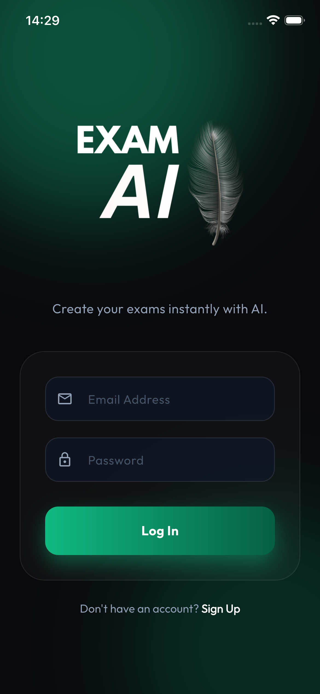
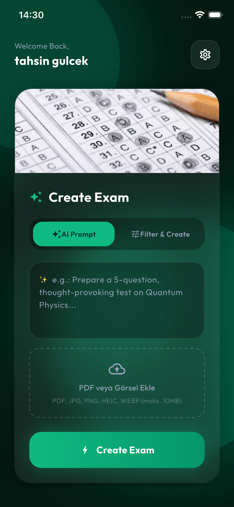
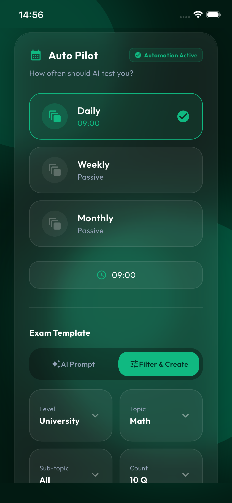
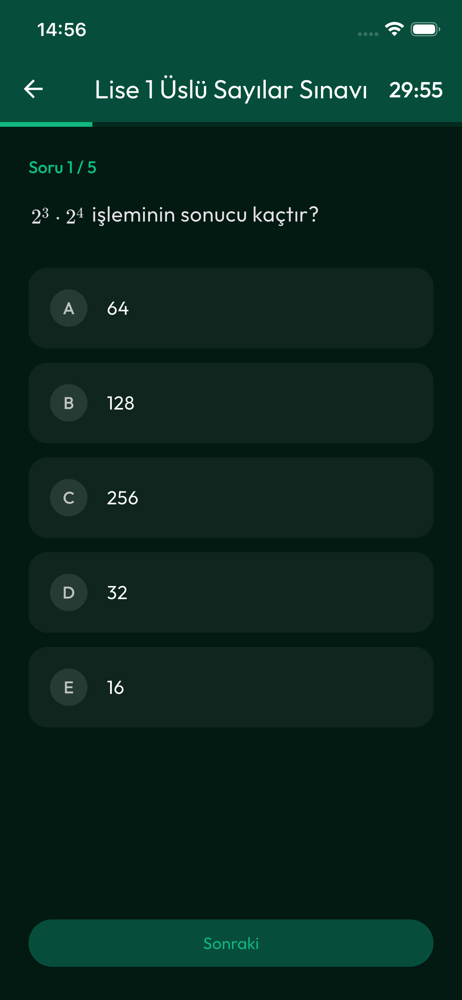
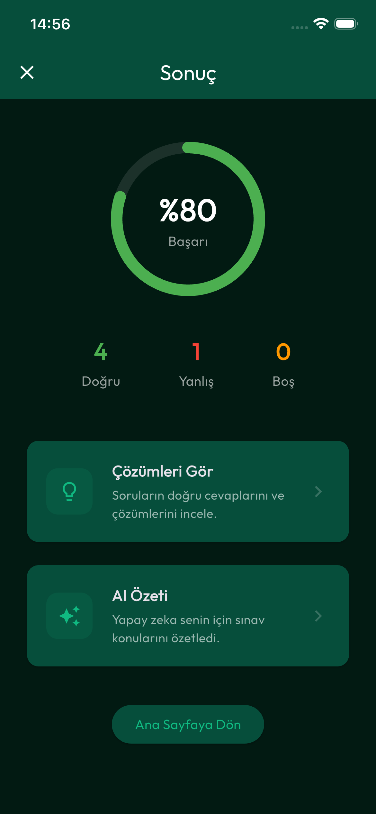
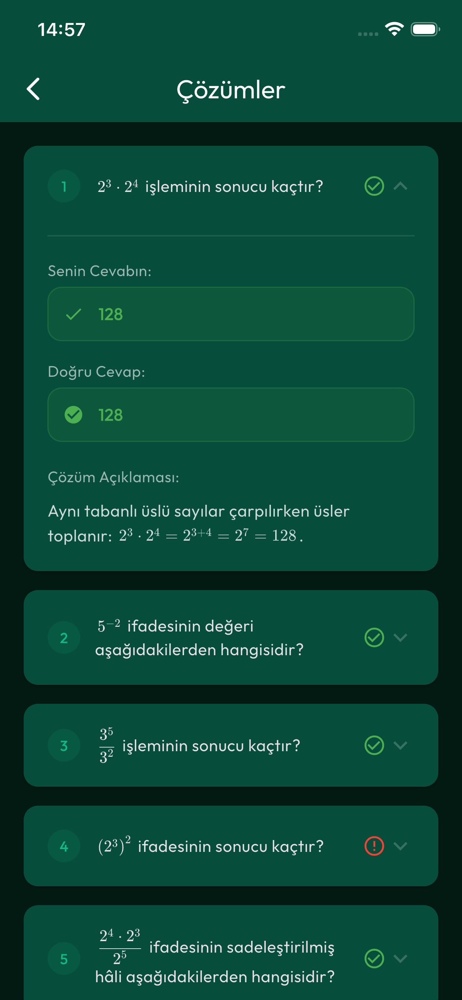

# ExamAI 🚀

ExamAI is a cutting-edge, AI-powered exam generation platform designed to help students and educators create personalized practice exams in seconds. Using advanced LLM models (GPT-4), it generates high-quality questions with detailed explanations, tailored to specific topics and difficulty levels.

## ✨ Features

- **AI Exam Generation**: Instant creation of exams from text prompts or uploaded documents (PDF/Images).
- **Auto Pilot (Smart Scheduling)**: Set your topics and schedule; ExamAI automatically prepares your practice exams while you sleep.
- **Mixed Question Types**: Supports Multiple Choice, True/False, and Open-Ended questions with AI-powered scoring.
- **Comprehensive Analysis**: Detailed results with correct answer explanations and performance tracking.
- **Premium Subscription**: Tiered access with daily limits for FREE users and extended quotas for PRO members.
- **Cross-Platform**: Beautiful, responsive UI built with Flutter for both iOS and Android.

## 📸 Screenshots

| Login & Auth | Create Exam | Auto Pilot |
| :---: | :---: | :---: |
|  |  |  |

| In-Exam UI | Results & Scoring | Detailed Solutions |
| :---: | :---: | :---: |
|  |  |  |

## 🛠️ Tech Stack

### Frontend
- **Framework**: Flutter
- **State Management**: Riverpod
- **Navigation**: GoRouter
- **Persistence**: Flutter Secure Storage & Shared Preferences
- **Icons & Fonts**: Google Fonts & Font Awesome

### Backend
- **Runtime**: Node.js (TypeScript)
- **Framework**: Express.js
- **ORM**: Prisma
- **Database**: PostgreSQL (Dockerized)
- **Background Tasks**: BullMQ (Redis)
- **Cloud Printing**: Firebase Admin SDK

## 🚀 Getting Started

### Prerequisites
- Flutter SDK (Latest)
- Node.js & NPM
- Docker Desktop (for PostgreSQL & Redis)

### Backend Setup
1. Navigate to the `backend` folder.
2. Install dependencies: `npm install`
3. Set up your `.env` file (Database URL, JWT Secret, LLM API Key).
4. Start the database: `docker-compose up -d`
5. Run migrations: `npx prisma migrate dev`
6. Start the server: `npm run dev`

### Frontend Setup
1. Navigate to the `examai_flutter` folder.
2. Install dependencies: `flutter pub get`
3. Configure your API base URL in `lib/core/api/api_client.dart`.
4. Run the app: `flutter run`

## 💎 Subscription Model (Optional)
This app includes **Real In-App Purchase (IAP)** integration. 
- **FREE**: 3 exams/day, No Auto Pilot.
- **PRO**: 25 exams/day, 20 Active Auto Pilot configs, Advanced AI models.

## 📄 License
This project is private and all rights are reserved.
